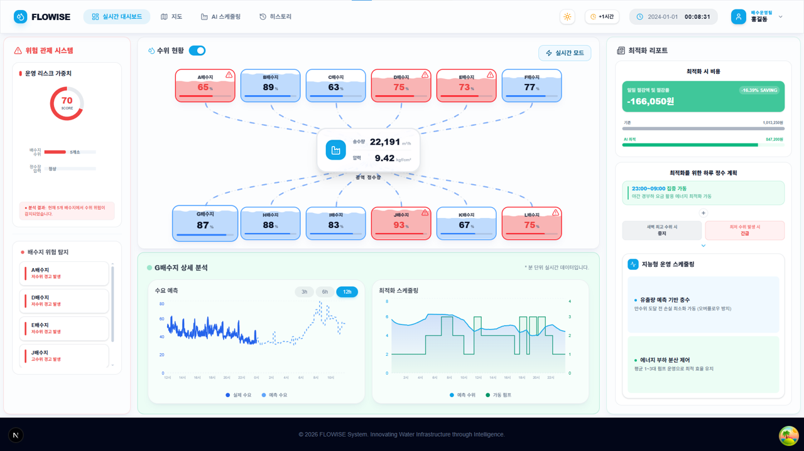

# 🌊 FLOWISE - Smart Water Management System



**FLOWISE**는 AI 기반 수자원 관리 시스템으로, 미래 수돗물 수요를 정밀하게 예측하고 펌프 가동을 최적화하여 에너지 효율을 극대화하는 솔루션입니다.

---

## 🛠 Tech Stacks

### Frontend
- **Framework**: Next.js 16 (App Router)
- **Library**: React 19
- **State Management**: Jotai (Atomic State)
- **Data Fetching**: **TanStack Query v5 (React Query)**
- **Styling**: Tailwind CSS 4 (+ Glassmorphism UI)
- **Visualization**: Recharts
- **Icons**: Lucide React
- **Notifications**: Sonner

### Technical Highlights
- **Custom Fetch Wrapper**: `credentials: "include"`를 통한 세션 관리 및 401 에러(Unauthorized) 발생 시 자동 랜딩 페이지 리다이렉트와 리프레시 토큰 갱신 로직 구현.
- **Mock Data System**: 백엔드 서버 없이도 모든 기능을 테스트할 수 있는 정교한 시뮬레이션 기반 Mock API 서비스 탑재.
- **Performance Optimization**: TanStack Query의 `staleTime` 설정을 통한 효율적인 캐싱 관리 및 스켈레톤 UI(Skeleton UI)를 활용한 체감 로딩 속도 향상.

---

## ✨ 핵심 기능 (Features)

1. **AI 수요 예측 (Demand Prediction)**
   - 85% 이상의 높은 정확도로 시간별 수돗물 수요를 예측합니다.
   - 실제 수치와 예측 수치를 시각적으로 대조하여 운영 효율을 높입니다.

2. **펌프 가동 최적화 (Optimization)**
   - 예측된 수요를 기반으로 전력 비용이 최소화되는 펌프 가동 스케줄을 자동으로 수립합니다.
   - 에너지 비용을 약 5% 이상 절감하는 최적 경로를 제안합니다.

3. **실시간 모니터링 및 히스토리 뷰어 (Monitoring)**
   - 정수장 및 배수지의 수위, 유량, 압력 데이터를 실시간으로 트래킹합니다.
   - 과거 데이터를 통한 운영 데이터 분석 기능을 제공합니다.

4. **사용자 친화적 대시보드 (UX/UI)**
   - **Glassmorphism Design**: 세련된 유리 질감 UI로 가독성과 심미성 확보.
   - **Dark Mode**: 다크 모드 완벽 지원 및 지도(Kakao Map) 다크 모드 동기화.
   - **Responsive**: 모바일 환경을 고려한 상단 메뉴 네비게이션 및 반응형 레이아웃.

---

## 📽️ 구현 영상
<iframe width="991" height="558" src="https://www.youtube.com/embed/YxdRPamhfK0" title="정수장 프로젝트" frameborder="0" allow="accelerometer; autoplay; clipboard-write; encrypted-media; gyroscope; picture-in-picture; web-share" referrerpolicy="strict-origin-when-cross-origin" allowfullscreen></iframe>

---

## 🛠 Tech Stacks

### Frontend
- **Framework**: Next.js 16 (App Router)
- **Library**: React 19
- **State Management**: Jotai (Atomic State)
- **Data Fetching**: **TanStack Query v5 (React Query)**
- **Styling**: Tailwind CSS 4 (+ Glassmorphism UI)
- **Visualization**: Recharts
- **Icons**: Lucide React
- **Notifications**: Sonner

### Technical Highlights
- **Custom Fetch Wrapper**: `credentials: "include"`를 통한 세션 관리 및 401 에러(Unauthorized) 발생 시 자동 랜딩 페이지 리다이렉트와 리프레시 토큰 갱신 로직 구현.
- **Mock Data System**: 백엔드 서버 없이도 모든 기능을 테스트할 수 있는 정교한 시뮬레이션 기반 Mock API 서비스 탑재.
- **Performance Optimization**: TanStack Query의 `staleTime` 설정을 통한 효율적인 캐싱 관리 및 스켈레톤 UI(Skeleton UI)를 활용한 체감 로딩 속도 향상.

---

## ✨ 핵심 기능 (Features)

1. **AI 수요 예측 (Demand Prediction)**
   - 85% 이상의 높은 정확도로 시간별 수돗물 수요를 예측합니다.
   - 실제 수치와 예측 수치를 시각적으로 대조하여 운영 효율을 높입니다.

2. **펌프 가동 최적화 (Optimization)**
   - 예측된 수요를 기반으로 전력 비용이 최소화되는 펌프 가동 스케줄을 자동으로 수립합니다.
   - 에너지 비용을 약 5% 이상 절감하는 최적 경로를 제안합니다.

3. **실시간 모니터링 및 히스토리 뷰어 (Monitoring)**
   - 정수장 및 배수지의 수위, 유량, 압력 데이터를 실시간으로 트래킹합니다.
   - 과거 데이터를 통한 운영 데이터 분석 기능을 제공합니다.

4. **사용자 친화적 대시보드 (UX/UI)**
   - **Glassmorphism Design**: 세련된 유리 질감 UI로 가독성과 심미성 확보.
   - **Dark Mode**: 다크 모드 완벽 지원 및 지도(Kakao Map) 다크 모드 동기화.
   - **Responsive**: 모바일 환경을 고려한 상단 메뉴 네비게이션 및 반응형 레이아웃.

---

## 📽️ 구현 영상
<iframe width="991" height="558" src="https://www.youtube.com/embed/YxdRPamhfK0" title="정수장 프로젝트" frameborder="0" allow="accelerometer; autoplay; clipboard-write; encrypted-media; gyroscope; picture-in-picture; web-share" referrerpolicy="strict-origin-when-cross-origin" allowfullscreen></iframe>

## 📖 History (Update Log)

### 2026/01/28
- 대시보드 형식 수정 (상단 메뉴 네비게이션 적용)

### 2026/01/29
- 글래스모피즘(Glassmorphism) 기반 디자인 통일

### 2026/01/30
- 기본적인 CRUD 구현을 위한 회원 정보 수정 및 탈퇴 기능 추가

### 2026/02/02
- 공통 컴포넌트 추출 (Input, Button, Select 등)
- 동적 라우팅(`[id]`)을 통한 배수지 상세 모달 연동 및 브라우저 히스토리 지원
- 배수지 수요예측 그래프 구현 (백엔드 API 연동)

### 2026/02/03
- 메인 대시보드 고도화 및 시설 정보 동적 로딩

### 2026/02/04
- 커스텀 훅 패턴 도입: 데이터 로드, 리셋 등 비즈니스 로직 캡슐화

### 2026/02/05
- 인증 시스템 구축 (로그인, 회원가입, 정보 수정)
- Custom Fetch Wrapper 구현 (Credentials, 401 에러 핸들링)
- 그래프 시각화 디자인 시스템 통일

### 2026/02/06
- Sonner 라이브러리 기반 알림창 커스텀
- 리프레시 토큰(Refresh Token) 갱신 로직 보완
- Loading 상태 관리를 통한 데이터 중복 호출 방지

### 2026/02/09
- 백엔드 에러 메시지(`response.json().message`) 동적 연동
- 환경 변수(`.env.local`)를 통한 BaseUrl 관리 및 CORS/Cookie 이슈 최적화
- 모바일 뷰 하단 여백 및 h-full 레이아웃 버그 수정

### 2026/02/10
- 전역 스크롤바 커스텀 스타일링 (`global.css`)

### 2026/02/11
- 스켈레톤 UI 고도화 (컴포넌트 단위: 차트, 맵, 카드 등 / 페이지 단위: 모달 등)
- 데이터 수집 에러 발생 시 재시도(Retry) UI 제공
- 실시간 수위 현황 시각화 방식 변경 (모니터링 강화)

### 2026/02/12
- 스케줄링 페이지 레이아웃 개편 (설명 영역 vs 분석 영역 분리)
- 히스토리 뷰어 페이지 강화

### 2026/02/13
- `requestAnimationFrame(rAF)`를 활용한 부부드러운 수위 흐름 애니메이션 구현
- 대시보드 차트 클릭 시 상세 상세 대화상자(Modal) 팝업 연동

### 2026/02/19
- React `createPortal`을 활용한 모달 레이어 스택 최적화
- `toLocaleString` 속성을 활용한 금액 포맷팅 고도화
- 의존성 기반 커스텀 훅 자동 로드 로직 최적화 (코드 효율화)

### 2026/02/20
- 맵 페이지 사이드바 상세 정보 레이아웃 적용
- 구체적인 펌프 가동 가이드라인 영역 추가

### 2026/02/23
- 히스토리 뷰어: 월간 합계 및 일간 상세 트렌드 교차 분석 기능
- 예측 차트 `isProcessing` 상태 핸들링 및 15분 간격 자동 갱신 로직 구현

### 2026/02/24
- **TanStack Query** 전면 도입: 서버 상태 관리 캐싱/Stale 타임 최적화

### 2026/02/26
- `next-themes` 기반 다크모드 시스템 구축
- 수위 패널 타임 슬라이드 기능 추가 (동기적 데이터 시각화)

### 2026/02/27
- 카카오맵 다크모드 커스텀 필터링 적용
- 대시보드 시뮬레이션 모드 (What-if 분석) 추가

---

## 📁 폴더 구조 (Folder Structure)

```text
src/
├── api/            # API 연동 및 Mock 서비스 레이어
├── app/            # Next.js App Router (페이지 및 레이아웃)
├── atoms/          # Jotai 전역 상태 정의
├── components/     # UI 공통 컴포넌트 및 도메인별 컴포넌트
├── hooks/          # TanStack Query & 비즈니스 로직 커스텀 훅
└── types/          # TypeScript 타입 정의
```

---

## 🔐 환경 변수 설정 (Environment Variables)

`.env.local` 파일을 생성하여 아래 값을 설정해야 합니다.

```env
NEXT_PUBLIC_SERVER_URL=your_api_server_url # 백엔드 API 주소
```

---

<p align="center">
  <b>FLOWISE</b> - 데이터로 잇는 지속 가능한 수자원 인프라
</p>
